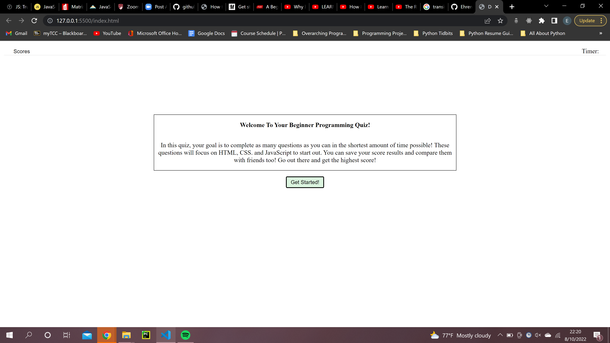
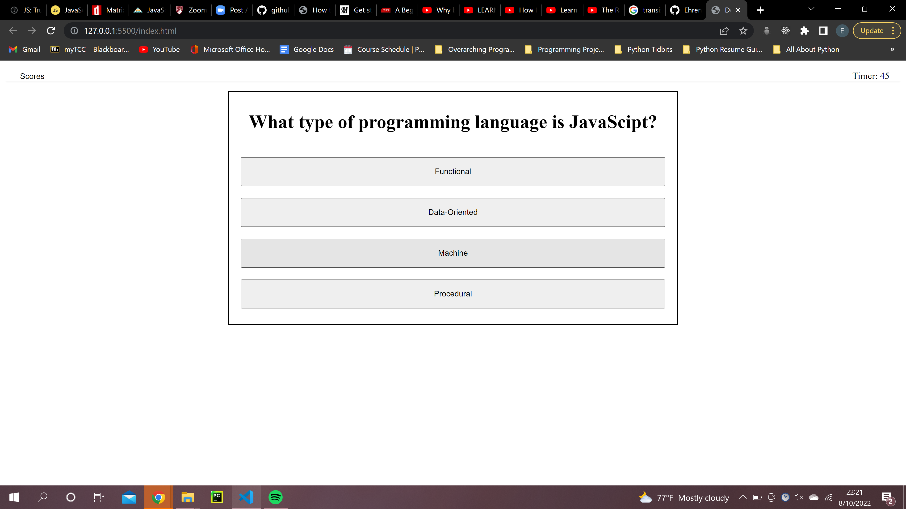
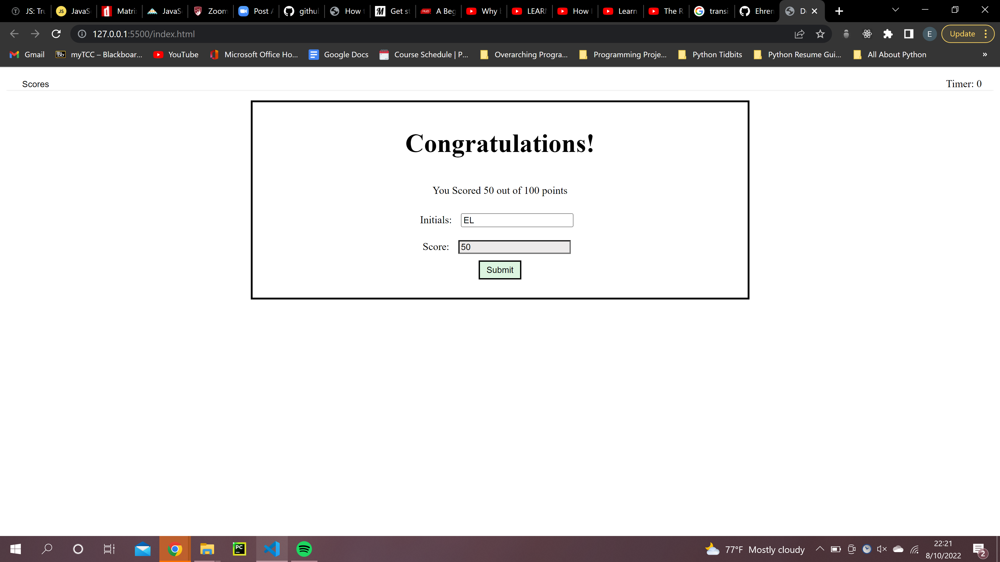
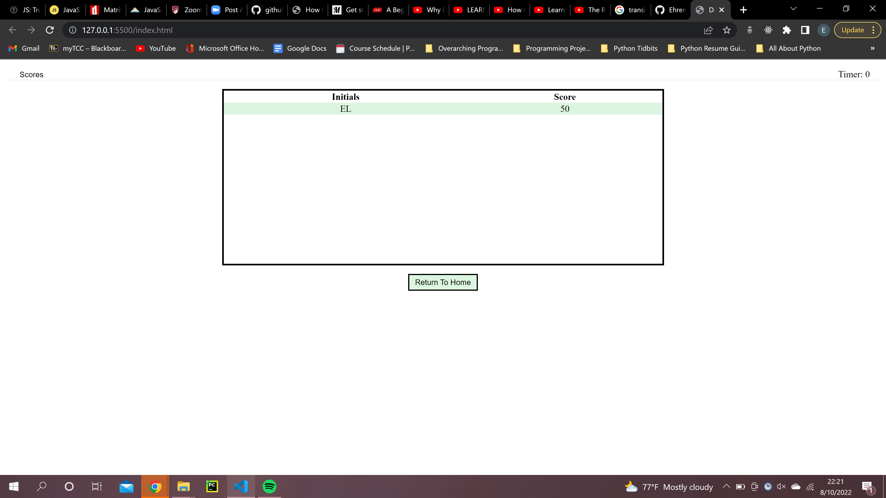

# Quiz-With-Friends

Author: Ehren Lewis

# About This Project
The motivation for this project was wanting to create my own qquiz application, because knowing how to create my own quiz application and answers means that I myself know the answers, boosting my programming knowledge in the process.

I built this project to allow for individuals to test their knowledge on the foundations of HTML, CSS, and JavaScript.

As well, this project was only built with HTML, CSS, and JavaScript

I learned about how to use getting and setting items to local storage, how to implement a timer function that essentially run asynchronously from the quiz itself. I learned more about object manipulation and traversing bigger length data structures, such as an array of objects.

known issues: There is nothing set for mobile responsiveness, so there may be an issue on viewing it on smaller screens.S

For future versions: I would like to switch the setup from localstorage to a databse system, and perhaps switching it from pure vanilla jacascript to jquery

# How to Install

1. Navigate to the code repository
2. Press the green code button, located near the about section
3. Copy either the HTTPS, Git CLI, download the zip, open with GitHub desktop, or copy the SSH link.
4. Depending on download method, use Git, executable, or the desktop application to open the content files
5. All of the content of the repository will be available after completion of the previous state.

# OR

1. Visit the live site
2. Copy the files from the developer tools into your own files

link to repository: https://github.com/Ehren-Lewis/Quiz-With-Friends
link to live site: https://ehren-lewis.github.io/Quiz-With-Friends/

# Usage

This project can be used as an educational tool to test ones knowledge over 
some of the foundations ofT HML, CSS, and JavaScript

Press either the scores button to view the scores already submitted (this will be blank if there are none in the local storage)

Press the get started button to start the quiz. Use the answer buttons to answer
the selected question prompt. To provide an added challenge and to 
encourage one to pursue knowledge on their own, correct answers will not
be provided, rather it is designed to have one do some more learning and return
once more knowledge has been acheived.

One the quiz is completed (or the timer has hit 0), then the user will be presented their score, as well as a form for them to be able to input their
initials. Refreshing at any point will lose ones score and one will have to take the entire quiz over again. If one hits submit, they will be presented with the a table of all submitted scores that are stored in ones local storage. These will be sorted form highest to lowest. From their, one may exit the browser, or press the home button to attempt the quiz again.

